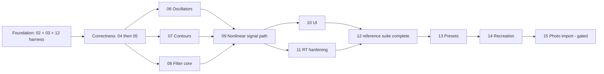

# Synthesizer Remediation Roadmap

Status: Workstream 04 PIT-001/PIT-002/PIT-004 pass through governed pitch evidence; the 2026-07-25 whole-branch repair preserves musical live glide and structurally bounds `audio.pitch.v2`; PIT-003 has complete five-musical-range software evidence but remains `awaiting-approved-reference` for LO/hardware calibration. PIT-005...008 and full Workstream 12, external, hardware, host, listening, and release validation remain open.
Repository baseline inspected: `main` at `c30038d` (`Update README.md`).
Audit corpus: the attached **Synthesizer Remediation Planning Suite** specification. It is the only supplied original-audit text, so every sentence-level deficit and proposed product improvement in that specification is treated as a finding. The line-by-line ownership audit is in the [traceability matrix](01-traceability-matrix.md).

## Implementation control

The core planning baseline is this roadmap, the traceability matrix, and Workstreams 02–15. Operational execution is coordinated through the canonical [implementation handoff](17-implementation-handoff.md); the [Agent 07 Workstream 03 kickoff](18-agent-07-workstream-03-kickoff.md) is now a completed execution record. The implementing agent must update this table, its active workstream plan, and the handoff as work progresses; the matrix is updated in the same change whenever implementation evidence invalidates a finding, dependency, requirement, acceptance criterion, or ownership decision.

| Phase | Active workstream | Status | Entry gate | Exit/next owner |
|---|---|---|---|---|
| F0 — reproducible baseline | [02 Build, Packaging, and Host Validation](02-build-packaging-host-validation.md) | In progress as a pre-release validation track; exact run `29728203657` passes all eight supported rows, BLD-007 now passes through the [owner identity/deferral decision](evidence/workstream-02/owner-identity-and-deferral-decision.md), and BLD-006/011/012 remain in progress pending external host/account/tool evidence | Approved planning baseline | Retain BLD-006/011/012 as visible pre-release gates; accept owner-supplied external evidence later without invalidating the Workstream 03 automated freeze or Workstream 12 coordination. |
| F0 — reproducible baseline | [03 Parameter, Automation, and State Contract](03-parameter-automation-state-contract.md) | Automated contract freeze complete; PAR-001/003/005/008/009 pass, while PAR-002/004/006/007 remain in progress for designated-host or later DSP/harness evidence | Workstream 02 automated build/test seams pass; owner-approved exception carries BLD-006/011/012 as pre-release gates | Preserve the frozen contracts; close the named manual/pre-release obligations through Workstream 12 and designated-host validation. |
| F0 — reproducible baseline | [12 Reference/Test harness](12-hardware-reference-regression-system.md) | F0 skeleton extended by Workstream 04: eight deterministic fixtures, five versioned analyzers, 24 governed indexed inputs, a globally draft acceptance policy, exact 127-requirement map, 164-gate canonical report, and release enforcement are committed and verified. V2 work is structurally capped at `64000000` pairs. The report is 17 pass / 91 not-run / 19 awaiting / 0 fail and non-release-ready. TST-001–009 remain individually `in-progress`. | Workstream 02 test/offline targets and Workstream 03 automated contracts are stable | Continue full Workstream 12 completion through F4 while retaining every owner/pre-release gap. |
| F1 — processor seam freeze | [04 Pitch, Tuning, Glide, and Modulation](04-pitch-tuning-glide-modulation.md) | In progress: [PIT-001/PIT-002 pass](evidence/workstream-04/pit-001-pit-002-pitch-foundation.md); [PIT-003 software matrix complete but awaiting approved LO/hardware reference, and PIT-004 pass](evidence/workstream-04/pit-003-pit-004-pitch-matrix.md). Typed pitch, checked instantaneous glide composition, 54 cross-rate gates with current maximum `0.005411181877115`, published ±7-semitone bend, a fresh exact-head 50-file repair candidate, and authoritative replay pass. PIT-008 still owns static scheduling/caching. PIT-005...008 remain open. | Accepted F0 harness plus frozen Workstream 03 contracts | Keep PIT-003 non-pass until approved LO/hardware evidence exists; complete open Task 8 packaging, then implement PIT-005 and PIT-006...008 while retaining all parallel BLD/PAR/TST pre-release obligations. |
| F2–F6 | Workstreams 05–15 | Not started | The phase gates below, including complete Workstream 04 exit criteria | Follow the fixed roadmap order; no agent skips an unmet gate. |

## Successor handoff package policy

Every implementation agent must end its session by creating one verified,
self-contained successor ZIP that the user can attach to the next agent. This
obligation applies whether the workstream is complete, incomplete, failed, or
externally blocked.

The agent first reconciles and commits all tracked implementation, planning,
evidence, and canonical handoff changes. It then builds the ZIP from that exact
committed state and leaves the archive untracked. The archive must have one
top-level directory and contain a copy-ready `START-HERE.md`, current
`HANDOFF.md`, complete planning/evidence suite, required primary references,
repository/commit state, verification summary, and an internal SHA-256 content
manifest. It must exclude Git metadata, build trees, downloaded validators,
credentials, user settings, recovery files, prior archives, and unrelated
workspace content.

Before reporting completion, the agent verifies ZIP integrity, safe entry paths,
absence of symbolic links, fresh extraction, internal manifest hashes, and
source-to-package equality. The final response gives the archive's clickable
absolute path, size, outer SHA-256, verification result, and the successor's
first action. `START-HERE.md` must repeat this policy so every successor
continues the handoff-package chain.

## Product outcome

A musician must be able to copy a documented Minimoog Model D panel setting into this product and first obtain the behavior of an authentic, calibrated Model D signal path. A separate Recording Recreation layer may then add sourced information about the reference instrument, performance, feedback routing, effects, amplification, tape, microphones, EQ, compression, mixing, and multitracking.

Panel positions alone are not a promise of an exact recording match. Component tolerance, calibration, playing technique, routing, and the recording chain remain material. Product language must therefore use “authentic panel behavior” for the first layer and evidence-qualified “recording recreation” or “perceptual similarity” for the second. Bit identity is not a success criterion.

## Fixed product decisions

These decisions are inputs to every workstream and may not be reopened by an implementation agent.

| Topic | Decision |
|---|---|
| Product identity and history | No prior distribution exists. Approved host identity is TTH Audio / TTH Model One, manufacturer/product codes `TTHA` / `TM01`, reverse-DNS domain `io.github.tthrelk93`, and bundle ID `io.github.tthrelk93.TTHModelOne`. |
| Temporary external-gate scheduling | Workstream 03 may proceed while BLD-006/011/012 remain visibly in progress as pre-release gates. No unrun DAW, designated-account, AU, or SDK-validator check may be represented as passing. |
| Classic defaults | Low-note priority and single-trigger legato (multi-trigger off). |
| Modern options | Saved, automatable Low/High/Last priority and Single/Multi trigger parameters. |
| Plug-in topology | One MIDI instrument target. It has a required stereo main output, an optional stereo auxiliary **External Input**, and an optional stereo **Phones/Cue** output where the wrapper/host supports auxiliary outputs. There is no separate effect target in the initial remediation. |
| Authentic layer | A one-to-one Model D panel and engine contract. UI position and parameter value are deterministic; reference-unit calibration is a separately identified profile. |
| Recreation layer | Non-destructive metadata and optional downstream processing layered above an immutable copy of the authentic panel state. |
| Parameter compatibility | Existing host parameter IDs remain addressable. New instances use canonical contour semantics. Unversioned sessions/presets load in an explicit `legacyCrossedContours` compatibility mode so stored values and existing automation retain the old audible routing; conversion is opt-in and never silent. |
| State versions | Host state root `modelDState`, `stateVersion = 2`. Preset document `modelDPreset`, `schemaVersion = 2`. Unknown future major versions fail safely without partially applying state. |
| Source claims | Every recording association has a URL or bibliographic citation, capture/access date, and confidence label (`confirmed`, `strong`, `plausible`, or `speculative`). Speculative data is never labeled definitive. |
| Official patch sheets | General factory-preset sources unless an independent reliable source ties a sheet to a recording. Redistribution requires a recorded license decision. |
| Photographed import | Gated future feature. It cannot start until Authentic Panel geometry, preset schema v2, provenance rules, and training-data licensing are stable. |
| Hardware fidelity | Published values are hard source constraints. Unit-specific waveform, taper, resonance, saturation, drift, and calibration tolerances must come from a documented measurement campaign, never an implementer’s guess. |
| Subjective review | Supplemental evidence only. Numerical, state, host, and real-time gates must pass independently. |

## Published Model D constraints

The bundled official [Minimoog Model D manual](../../Minimoog_Model_D_Manual.pdf) is the initial primary source. Page 47 documents low-note priority as the classic/default behavior and defines legato as Multi-Trigger Off. Page 80 publishes these endpoints:

| Property | Published constraint | How used |
|---|---:|---|
| Oscillator frequency | 0.1 Hz to 20 kHz across six overlapping ranges | Range and endpoint gates; waveform calibration still measured. |
| Filter cutoff | 10 Hz to 20 kHz | Endpoint gate. Cutoff-taper and resonance tuning require measurement. |
| Filter slope | 24 dB/octave | Structural/sweep gate with measurement-derived analysis uncertainty. |
| Filter contour width | 0 to 4 octaves | CV-domain contour mapping gate. |
| Contour attack | 1 ms to 10 s | Endpoint gate; knob taper and curve shape require measurement. |
| Contour decay/release | 4 ms to greater than 35 s | Endpoint gate; top endpoint and taper require measurement. |
| Sustain | 0–100% of contour peak | Endpoint/monotonicity gate. |
| Loudness dynamic range | 80 dB | Published performance gate with the measurement procedure in Workstream 12. |
| Glide, one octave | 1 ms to 10 s | Time-per-octave endpoint gate. |
| Pitch bend | ±7 semitones | Pitch-domain endpoint gate. |
| Keyboard tracking | Switch 1 = 1/3, Switch 2 = 2/3, both = 1 octave/octave | Exact CV-domain mapping gate. |

If a later official manual revision conflicts with the bundled manual, do not silently update behavior. Add the new publication to the reference manifest, record the affected instrument version, and obtain a product decision about which version each calibration profile represents.

## Current repository findings

Inspection confirmed that the approved audit remains materially accurate without relying on stale line numbers:

- The baseline README promised a CMake build while no `CMakeLists.txt` existed. Workstream 02 now supplies the supported CMake/CI build and reconciled README commands. Exact implementation run `29728203657` passes fresh configure/build, 9/9 CTest, every label, lifecycle, validators, linked manifests, and upload on all eight supported rows.
- `MiniMoog.jucer` still contains `../../Downloads/JUCE/modules` and tracked `JuceLibraryCode/JucePluginDefines.h` retains historical placeholder/effect metadata, but neither is authoritative or compiled by the supported CMake build. The supported wrapper is one MIDI instrument, and `cmake/ProductIdentity.cmake` now carries the owner-approved TTH Model One identity; BLD-007 does not require editing historical non-authoritative generated files.
- `MoogMiniAudioProcessor::createParameterLayout` repeats metadata inline, defaults `tune` to index 0 rather than `Zero`, gives several unrelated parameters the name “Output Volume,” and has no state version, note-priority, trigger-mode, or main-output parameter.
- `MoogMiniAudioProcessor::processBlock` cross-routes filter/loudness contour controls, processes all MIDI before rendering the block, stops oscillators on note-off before release, uses a single `currentNoteNumber`, performs repeated per-sample filter and still-open PIT-008 pitch-control/composition work, applies filter modulation in linear hertz, and reads a `feedbackKnob` that does not create an audible feedback path. PIT-001/PIT-002/PIT-004 route musical pitch and the symmetric wheel through the typed semitone authority; the repair makes every keyboard-controlled musical oscillator consume checked instantaneous glide frequency. It does not claim PIT-006/PIT-007 trajectory semantics or the remaining lifecycle, modulation, static scheduling, or caching work.
- Musical Oscillator 2/3 pitch now maps the `Frequency` enum index (0–16) to −8…+8 through `PitchDomain`; the five musical ranges use exact zero baseline software calibration and the normalized wheel maps as `14 * (position - 0.5)`. The deliberately preserved LO compatibility path remains pending approved calibration, so PIT-003 is not pass. `Oscillator::processNextSample` still directly emits discontinuous saw/square/pulse waveforms, allocates a `juce::String` per sample, and uses complementary 70/30 pulse shapes.
- `EnvelopeGenerator` is a linear ADSR-like generator. `normalizedToMilliseconds` maps the zero position to 100 ms and other values linearly to 10 seconds. The Decay switch currently changes held sustain routing instead of only enabling post-key-release reuse of decay time.
- `LadderFilter::computeFilter` is four Euler one-poles and subtracts the last stage separately inside every stage. `feedback`, `feedbackAmount`, `contourEnvelopeAmount`, and `sampleRate` are not all explicitly initialized; calculated feedback is unused; filter contour is added in hertz with a fixed scale.
- `PluginEditor` overwrites `nestedMap[5][1]`, declares uninitialized position arrays, leaves Output Main and Phones positions commented out, leaves feedback construction commented out, and manually inverts contour bindings in the overlay. `PianoKey::isKeyPressed` is not initialized.
- `MoogMiniAudioProcessor::handleNoteOn`/`handleNoteOff` and `processBlock` share `incomingMidi` through a `CriticalSection`. The processor installs a process-global `FileLogger` writing unconditionally to the Desktop. Plain visualization arrays are written on the audio thread and copied/read on the UI thread without a complete publication protocol.
- `PresetManager` reads/writes unversioned APVTS XML directly, performs non-atomic saves, and has no provenance, factory/user distinction, migration ledger, calibration profile, or recreation layer. `PresetLibrary` contains no usable factory content.

The matrix records each of these deficits and every additional behavior required by the approved planning specification.

## Target architecture and integration seams

The processor becomes a thin wrapper around stable, testable contracts:

```text
host MIDI + UI event queue
          |
          v
   MonoNoteStack / GatePolicy ---- saved priority + trigger mode
          |
          v
 sample-bounded ModelDEngine::render(range)
          |
          +--> PitchControl --> OscillatorBank
          +--> ContourPair --> ModelDLadder
          +--> Mixer --> Ladder --> VCA --> Output/Phones
                               ^
                               +-- optional aux input or normalled feedback

audio thread --> lock-free VisualizationSnapshot --> UI
state/presets --> VersionedStateMigrator --> canonical parameter registry
tests --> OfflineRenderer + AnalyzerRegistry + acceptance-v1 manifest
```

Required public seams, frozen during the foundation checkpoint:

```cpp
struct RenderRange { int startSample; int numSamples; };
struct PitchFrame { double noteSemitones; double modulationSemitones; };
struct GateEvent { enum Type { noteOn, noteOff, retrigger, panic }; int note; float velocity; };
struct EngineBuses { AudioBlock mainOut; OptionalAudioBlock externalIn; OptionalAudioBlock phonesOut; };

class ModelDEngine {
public:
    void prepare(const ProcessSpec&, const CalibrationProfile&);
    void reset(ResetReason) noexcept;
    void apply(const GateEvent&) noexcept;
    void render(const RenderRange&, EngineBuses&) noexcept;
};
```

Concrete DSP classes may differ internally, but processor-facing meanings, units, ownership, and no-throw/no-allocation render contracts may not.

## Workstream catalog

| Order | Workstream | Primary outcome | Direct prerequisites |
|---:|---|---|---|
| 02 | [Build, Packaging, and Host Validation](02-build-packaging-host-validation.md) | Reproducible JUCE 8 instrument artifacts and validation | None |
| 03 | [Parameter, Automation, and State Contract](03-parameter-automation-state-contract.md) | Stable canonical metadata and deterministic legacy handling | 02 |
| 04 | [Pitch, Tuning, Glide, and Modulation](04-pitch-tuning-glide-modulation.md) | Correct semitone/CV pitch pipeline | 03, 12 harness |
| 05 | [Sample-Accurate MIDI and Monophonic Voice Lifecycle](05-sample-accurate-midi-monophonic-lifecycle.md) | Model D note/gate behavior at exact sample positions | 03, 04, 12 harness |
| 06 | [Band-Limited and Calibrated Oscillators](06-band-limited-calibrated-oscillators.md) | Alias-controlled, measured Model D waveforms | 03–05 seams, 12 harness |
| 07 | [Model D Contour Generators](07-model-d-contour-generators.md) | Published ranges and measured contour shapes | 03, 05, 12 harness |
| 08 | [Virtual-Analog Ladder Filter and CV-Domain Cutoff](08-virtual-analog-ladder-filter.md) | Stable whole-ladder model in octave/CV space | 03–07 seams, 12 harness |
| 09 | [Nonlinear Mixer, Feedback, VCA, and Output Path](09-nonlinear-signal-path.md) | Calibrated nonlinear path, real auxiliary input, stable feedback | 02, 03, 06–08 |
| 10 | [UI Correctness and Authentic Panel](10-ui-correctness-authentic-panel.md) | Safe, complete one-to-one panel plus educational overlay | 03, 05, 09 |
| 11 | [Real-Time Safety, Visualization, and Performance](11-real-time-safety-visualization-performance.md) | Bounded lock/allocation-free render path | 05–10, 12 harness |
| 12 | [Hardware-Reference and Regression Test System](12-hardware-reference-regression-system.md) | Reproducible analyzers, captures, and acceptance manifest | 02, 03; completed with 04–11 |
| 13 | [Versioned Presets and Official Patch Library](13-versioned-presets-official-library.md) | Migratable schema and licensed, sourced factory content | 03, 10–12 and DSP gates |
| 14 | [Recording Recreation Mode](14-recording-recreation-mode.md) | Evidence-qualified recreation metadata and comparisons | 09, 10, 12, 13 |
| 15 | [Photographed Patch-Sheet Import](15-photographed-patch-sheet-import.md) | Gated, confidence-aware assisted import | 10, 13, 14 plus data/license gate |

## Implementation phases and checkpoints



1. **F0 — reproducible baseline:** Workstream 02 builds and runs unit tests; 03 freezes parameter/state contracts; 12 supplies an offline-render skeleton and manifest schema. The skeleton is accepted; retained BLD/PAR/TST release gates remain visibly non-passing and continue in their owner tracks.
2. **F1 — processor seam freeze:** `ModelDEngine`, event, pitch, contour, ladder, and signal-path interfaces compile behind test doubles. Oscillator, contour, and filter work may then proceed in parallel, but no workstream independently edits parameter meanings.
3. **F2 — correctness integration:** 04 lands before 05. MIDI fixtures prove sample boundaries, priority, triggering, glide, and release behavior.
4. **F3 — DSP integration:** Merge 06, then 07, then 08 into the processor-facing engine; 09 lands after all three. Each stage must pass hard software gates even if hardware capture gates remain marked `awaiting-approved-reference`.
5. **F4 — product/reliability:** 10 completes all panel bindings; 11 removes real-time hazards; 12 freezes `acceptance-v1.json` from approved measurements and produces a full requirements report.
6. **F5 — content:** 13 may publish factory presets only after F4. 14 adds recording recreations without altering authentic panel data.
7. **F6 — future gate:** 15 starts only after geometry/schema freeze, a dataset/license review, and an explicit go/no-go record.

## Merge and ownership policy

- Every finding has exactly one primary owner in the [matrix](01-traceability-matrix.md). Dependencies may contribute code or evidence but do not close another workstream’s requirement.
- Workstreams 02–11 all touch `MoogMiniAudioProcessor` or its construction path. Merge in roadmap order. Prefer new engine classes and adapters; keep edits to `PluginProcessor.cpp/.h` to orchestration.
- Workstream 03 exclusively owns parameter IDs, user-facing names, units, normalization, defaults, `stateVersion`, and migration dispatch. Other plans request additions through that registry.
- Workstream 12 exclusively owns analyzer definitions, reference manifests, threshold provenance, golden regeneration, and the aggregate requirements report. DSP workstreams own passing their gates.
- Workstream 10 owns component geometry and bindings. Workstream 15 consumes exported geometry and must not create a second panel-coordinate model.
- A workstream report must list touched seams and conflicts. If a frozen contract must change, update this roadmap, the owner plan, the matrix, fixtures, and migration notes in the same review.

## Compatibility and preset migration policy

1. Never delete or reuse an existing host parameter ID for a different concept.
2. Treat state lacking `stateVersion` as version 0. Validate into a temporary tree; never partially apply malformed state.
3. Version 0 state receives `compatibility.contourContract = legacyCrossedContours`. The runtime and UI adapter preserve the previously audible crossed routing, including host automation. Values are not silently swapped.
4. New state uses `canonicalContours`: `filterAttackTimeKnob`, `filterDecayTimeKnob`, and `filterSustainKnob` feed Filter Contour; `loudnessAttackTimeKnob`, `loudnessDecayTimeKnob`, and `loudnessSustainLevelKnob` feed Loudness Contour.
5. An explicit “Convert legacy contour routing” action snapshots the state, swaps the six static values, changes the contract marker, warns that DAW automation lanes cannot be rewritten by the plug-in, and supports undo. If automation is detected or cannot be ruled out, conversion defaults to cancel.
6. Missing new settings default to Low priority, Single trigger, Main Output on, Authentic view, recreation disabled, and the baseline calibration profile. These defaults are recorded in the migration log.
7. Legacy XML preset files remain readable. Saving writes schema v2 atomically and keeps an optional backup of the source until the new file passes read-back validation.
8. Unknown parameters survive round trips in an `extensions` subtree when structurally safe; unknown future major schema versions are rejected with no state mutation.

## Real-time contract

After `prepareToPlay`, `processBlock`, all event dispatch called from it, and every DSP `process`/`render` function must be `noexcept` in practice and must:

- perform zero heap allocations/deallocations;
- acquire zero mutexes, spinlocks, file locks, or OS waits;
- perform no file I/O, logging, XML/JSON/string formatting, or global logger mutation;
- use preallocated bounded queues and snapshots with defined overflow behavior;
- produce finite output for finite input and parameter values;
- handle any host block length, including zero and larger-than-hinted blocks, by bounded chunking;
- keep per-sample work independent of UI visibility and host block size, except for linear O(samples) rendering;
- reset denormal, oversampler, delay, filter, feedback, contour, event-queue, and visualization state deterministically.

Workstream 11 supplies instrumentation; passing it is a release gate for all DSP workstreams.

## Acceptance-threshold governance

`tests/reference/acceptance-v1.json` is the planned single machine-readable threshold registry. It has three classes:

1. `published`: values copied with page/source/version metadata from a primary specification;
2. `derivedSoftware`: exact invariants or bounds derived from sample indices, IEEE representation, queue capacity, or analytic formulas, with the derivation stored beside the value;
3. `measuredHardware`: values calculated from approved captures under Workstream 12’s fixed procedure.

No `measuredHardware` field may be populated from memory, listening, a secondary source, or an implementer’s preference. Each value points to a reference-instrument record, calibration condition, capture chain, raw file hashes, analysis version, repeated-capture statistics, uncertainty budget, approver, and date. The acceptance band is generated from the approved repeated-capture distribution plus recorded measurement uncertainty. A DSP requirement depending on a missing measured field remains `awaiting-approved-reference`; it is not reclassified as passed.

Listening sessions are blinded, level-matched, randomized, and reported separately. They cannot waive hard failures.

## Release gates

- Trace report shows every matrix row `pass`; no `not-run`, `waived`, or unproven hardware gate.
- Clean Release and Debug builds on supported CI platforms, zero project-owned compiler/linker warnings, all unit/integration tests executed through CTest.
- VST3 and AU instrument identities/categories/buses are correct; `pluginval` strictness 10 and `auval` pass; designated commercial-host smoke matrix passes.
- State v0 and preset v0 migration preserve the captured legacy audible contract; v2 state/preset round trips are deterministic.
- Sample-accurate MIDI, low/high/last priority, single/multi trigger, release tails, panic behavior, and auxiliary-input routing pass exact fixtures.
- Published Model D endpoints pass and every hardware-derived gate has approved provenance.
- Audio callback instrumentation reports zero allocations and zero lock attempts; sanitizer and multi-instance suites report no project-owned races; CPU/latency gates pass the approved performance manifest.
- Authentic Panel contains every control once, automation and restoration reflect correctly, and recreation bypass leaves the authentic panel snapshot byte-for-byte unchanged.
- Factory and recreation content passes source/license/confidence review. Photo import is absent or separately passed its F6 gate.

## Planning-suite acceptance audit

The documentation task is complete only when:

- [x] One roadmap, fourteen detailed workstreams, and one matrix have stable numeric filenames.
- [x] The matrix treats each sentence-level finding in the supplied specification as a unique requirement.
- [x] Every requirement has exactly one primary owner and at least one verification method.
- [x] Every workstream has objective acceptance criteria, dependencies, compatibility behavior, real-time constraints, completion evidence, and references.
- [x] Dependencies implement the approved foundation → correctness → DSP → product/reliability → content → future-feature order.
- [x] An automated link check passes after all files are written.
- [x] `git diff --check` passes and only `docs/remediation/` is changed.

## Primary references

- Moog Music, [Minimoog Model D User’s Manual v2](../../Minimoog_Model_D_Manual.pdf), especially pp. 19, 23–33, 36, 43–51, and 80–81.
- Moog Music, [current Model D downloads](https://www.moogmusic.com/downloads/?type=User+Manual).
- JUCE, [CMake API](https://github.com/juce-framework/JUCE/blob/master/docs/CMake%20API.md), [`AudioProcessor`](https://docs.juce.com/master/classAudioProcessor.html), [`AudioProcessorValueTreeState`](https://docs.juce.com/master/classAudioProcessorValueTreeState.html), and [`SmoothedValue`](https://docs.juce.com/master/classSmoothedValue.html).
- Steinberg, [VST 3 plug-in categories](https://steinbergmedia.github.io/vst3_dev_portal/pages/FAQ/Miscellaneous.html).
- Apple, [Audio Unit Development Fundamentals](https://developer.apple.com/library/archive/documentation/MusicAudio/Conceptual/AudioUnitProgrammingGuide/AudioUnitDevelopmentFundamentals/AudioUnitDevelopmentFundamentals.html).
- Tracktion, [pluginval](https://github.com/Tracktion/pluginval).
- Tim Stilson and Julius O. Smith, [Analyzing the Moog VCF for Digital Implementation](https://quod.lib.umich.edu/i/icmc/bbp2372.1996.123/1/--analyzing-the-moog-vcf-for-digital-implementation?page=root;size=100;view=text).
- Antti Huovilainen, [Non-Linear Digital Implementation of the Moog Ladder Filter](https://dafx.de/paper-archive/2004/P_061.PDF).
- Vadim Zavalishin, [The Art of VA Filter Design](https://www.native-instruments.com/fileadmin/ni_media/downloads/pdf/VAFilterDesign_2.1.0.pdf).
